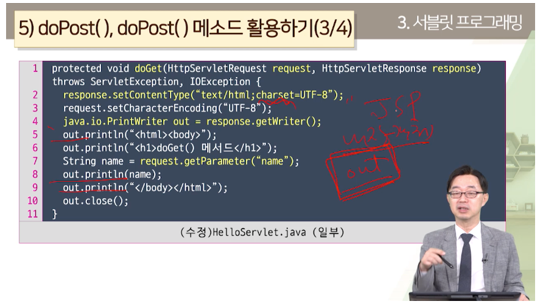

# JSP 처리 과정

### JSP 라이프 사이클
- JSP 최초 요청
> .jsp -> 서블리 자바 프로그램 .java로 변환,
> 그리고 컴파일 해서 .class 만들어 요청 처리
- 두번 째 요청
> 그냥 줌. 다만 JSP 페이지 수정되면 다시 변환/컴파일 작업

### 출력 버퍼와 응답
- 응답 만들 때 출력 버퍼에 기록.
- 그럼 buffer 속성이 none이 아니어야함.
- autoFlush true면 8KB(디폴트)차면 보내줌
- false하면 꽉 찼다? false 예외 발생
> 버퍼 쓰는 이유 : 전송 효율 향상, 실행 도중 에러 났다? 다른 내용으로 바꿀 수 있음.
> 에러 페이지 넣어서 가져다 줄 수도 있는거지. 전송 전이면 헤더의 내용도 변경할 수 있음.

- 버퍼 안 쓸꺼다?
> - <%page buffer="none" %> 오옹...
> - 그럼 <jsp:forward> 기능 쓸 수 없암,
> - 다른 페이지로 넘기는거. 근데 이미 왕창 넘어갔는데? 쓸 수 없어.
> - 오류페이지 주기도 어렵고
> - 전송도중 오류나도 그냥 오류랑 이전 결과랑 섞임.(출력결과 변경 x)

- <%@ page autoFlush="false" %> 버퍼 꽉 차면 에러 남 errorPage로 오류페이지 보내기 가능할 듯

### 오호 이클립스로 그냥 서블릿 클래스를 만들 수 있네?
> - new - servlet
> - 서블릿 클래스는 생성자, doGet(), doPost()를 가지고 있음.
> - 서블릿 실행하면
> - 생성자 > init() > service() > doGet() > doPost() 순으로 실행됨
> - init에 HttpServlet 정보 담긴 거 상속해서 만들어져있구나.
> - service는 클라이언트 요청 get인지 post인지 확인해서 doGet()이나 doPost() 불러줌

## +

요청받아서 response.setContentType();셋팅해주고,  
response.getWriter();에서 java.io.PrintWriter out나온거에다가
out.println("<html><body>")
...
String name = request.getParamter("name");  
out.println(name);  
out.println("</body></html>)  
out.close();  
이런 식으로 하면 넘겨준다.  