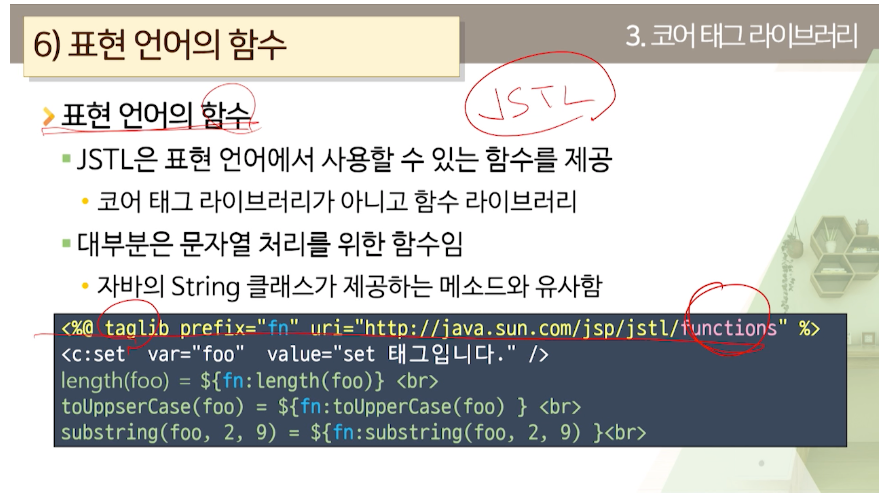

#액션 태그
> jsp:tagName
- 이거 다 표준 태그
- 제공해주는 것이야
> JSTL
  표준화 안된건데 유용해서 모아놓은 

** 모두 xml 태그여야 함.
태그이름 충돌피하기 위해 prefix 사용해야함.

```jsp
<%@ taglib prefix="c" uri="http://java.sun.com/jsp/jstl/core" %>
<c:forEach var="i" begin="1" end="100">
    <c:if test="i%2 ==0}">
        ${i}는 짝수입니다.
    </c:if>
</c:forEach>
```

뭐가 많네...
c:core 용 jstl (변수, 흐름제어, URL cjfl)
x:XML 용 jstl (xml)
fmt:국제화 용 jstl (메시지, 숫자 및 날짜형식)
sql:데이터베이스 용 jstl (sql)
fn:함수 용jstl (컬렉션, String 처리)

# 코어 태그 라이브러리
변수 처리/ 흐름제어/ URL처리/ 기타

set 변수 설정, remove 변수 제거
if choose, forEach, forTokens(구분자)
import redirect url catch out 등

<c:set> page, request, sesssion, application에 속성 저장
<c:set var="변수이름" value="변수 값" [scope="영역"]>

<c:set target="대상" property="속성 이름" value="값">
map의 원소, 자바빈 객체의 속성에 값 지정
대상 정할 때 꼭 표현식이나 표현 언어 사용해야함
<c:set target="<%=member%>" property="name" value="chan">
<c:set target="${m}" property="name" value="chan">

${}은 즉시 값을 계산하여 넣음.
#{} 필요할 때 사용할 때 계산.

<c:set var="bestMember" value="${member.name}"/>
<c:set var="bestMember" value="#{member.name}"/>
#은 지연계산

<c:remove var="bestMember"> 지움

<c:if test="조건">
if-else 안 됨 ㅋ
<c:choose>
    <c:when test="">
    </c:when>
    <c:when test="">
    </c:when>
    <c:otherwise>
    </c:otherwise>
</c:choose>

<c:forEach var="i" begin="1" end="10" step="10" varStatus="status>
    ${status.count}
    ${status.index}
    ${status.current}
<c:forEach var="m" items="${requestScope}"> //배열이나 컬렉션
    ${m.key} = ${m.value}

<c:import> <jsp:include> 비슷
<c:import url="URL" >
//외부 페이지도 가능!

```jsp
<c:import url="www.naver.com">
</c:import>

<c:import url="www.naver.com">
    <c:param name="name" value="jimy">
    <c:param name="age" value="10">
</c:import>

<c:url value="URL" var="변수" scope="영역">
자동 인코딩 해줌.
var 없으면 가져와서 브라우저에 출력하는건데
var 있으면 변수에다가 저 홈페이지의 내용들이
문자열로 저장된다.

<c:reidrect> redirect해준다
<c:out value> 속성 value에 문자 출력
사실 출력하는 건 많은데 만든 이유 특수문자 쓰려고
escapeXml 속성이 있음.
기본값 true면 <. > , $, ' , " -> &lt;, &gt;, &amp; 등으로 변환
xss공격 막으려고

<c:catch var="ex">
<%
    int a = 0, b= 2;
    b = b /a ;
%>
</c:catch>
<c:if test=${ex !=null}">
    예외 발생했다.
</c:if>
```
이런 것도 있군...

