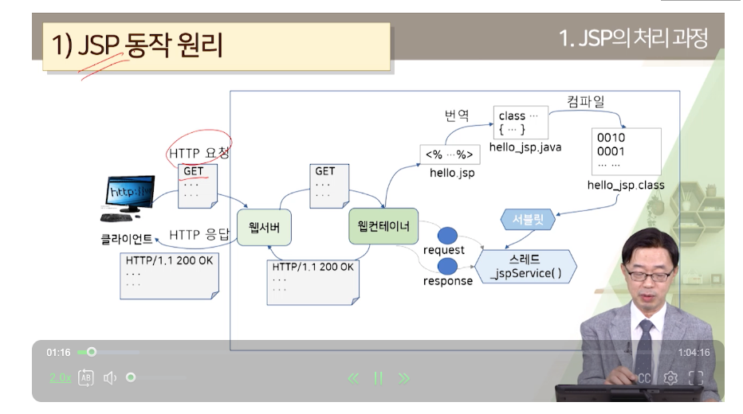
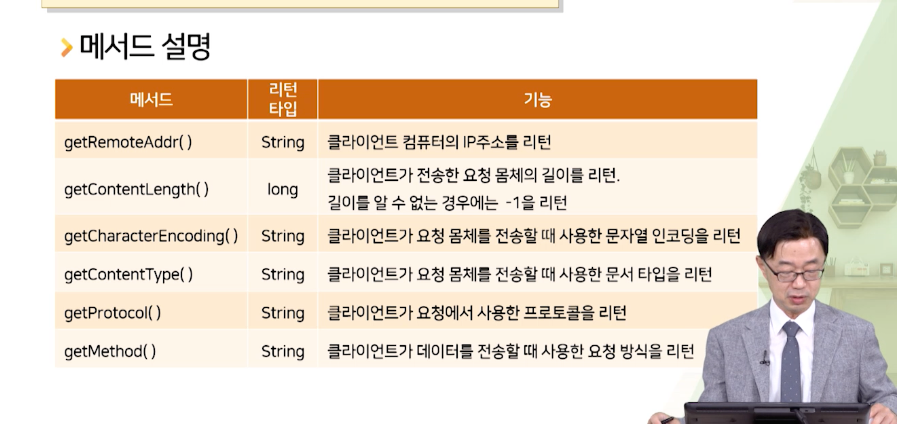

# 요청과 응답

요청 클라이언트가 페이지 주세요~ 하는 거고  
request 객체 담아서 가지고 있음.
응답은 웹 서버가 클라이언트 결과를 전송해주는 것  
response 객체에 담아서 보냄

##Request내장객체
- request 클라이언트의 요청을 표현하는 JSP 내장 객체
- HttpServletRequest(이 인터페이스 뜯어보면ㅎㅎ) 유형
- 클라이언트와 서버 관련 정보 읽기
- 데이터(파라미터) 읽기
- 헤더, 쿠기 정보 읽기

- getRemoteAddr() : 클라이언트 IP
- getContentLength() : 길이, 모르면 -1
- getCharaterEncoding() : 몸체 문자열 인코딩
- getContentType() : MIME
- getProtocol() : 프로토콜. 1.1쓰겟지
- getMethod() : 요청 메서드 post/get... put/delete등도 하려나?
이게 원래 구현을 그러면 get/post 안 맞으면 되돌려보내는 식으로 구현되어있겠지?
  아.. 엄... 컨트롤러는 그 요청만 받는다로 만들고 있겠구나!
  
서버 관련 정보!  

- getContextPath() : path요청
- getServerName() : 서버 주소 리턴 (local은 127.0.0.1)
- getServerPort() : 포트번호

<form>태그는 request 몸체에다가 데이터 담아서 넘기기 위함.</form>
<input name=""> 이름에 맞게 가져오겠지. submit
파라미터로 전송됨. 컨버터가 vo나 dto에 담아주기도 함.
action=""폼 핸들러임. 어디로 요청할거냐.
method="" post, get.. 

파라미터 읽어오기
- getParameter(String name)
- getParameterValues(String name) name가지고 있는 값들 배열로 가져와
- getParamterNames() 파라미터 이름 Enumeration으로 리턴
- getParameterMap() 맵으로도 받아올 수 있군! -> dto나 vo많이 쓸 듯

헤더 읽어오기
- getHeader(String name) : header 값
- getHeaders(String name) : 지정한 이름 모든 헤더 값 리턴
- getHeaderNames() : 모든 이름
- getIntHeader(String name) : 지정한 헤더의 값을 정수로
- getDateHeader(String name): 지정한 헤더의 값을 시간 값으로 리턴

### get방식
- 단순 질의나 검색
- a태그나 form에서 method="get"일 때
- URL 뒤에 쿼리 문자열 ?이름=값&이름=값&이름=값
- 보안 취약, 길이 제한
- 파라미터를 포함한 북마크가 가능
https://www.google.com/search?q=한국방송통신대학교
북마크해놓을 수 있구나! post는 북마크가 안되는군. 왜냐고? 주소가 다르잖어~~
  그렇네그렇네!!

### post방식
- HTTP 몸체
- 길이 x 보안 상대적으로 유리
- 히스토리, 북마크 x
- form method="post"

##Response내장객체
> HttpServletResponse 인터페이스를 구현한 객체

- setHeader() : 응답헤더 정보 설정
- sendRedirect() : 다른 페이지로 강제 이동
- addCookie() : 쿠기 추가
- setStatus() : 상태 코드 설정
- getWriter() or getOutputStream() : 응답 몸체를 만들기 위한 출력 스트림 객체 제공/ out

응답 헤더 정보 설정하기

- addHeader(String name, String value) : name 헤더에 value 값 추가
- addIntHeader(String name, int value)
- setHeader(String name, String value) : 헤더 값 변경  
이것도 키, value형태로 되어있군
- setIntHeader(String name, int value);
- containsHeader(String name):있냐?
- setContentType(String type) : MIME 설

같은 요청할 때
서버에 요청하지 않고 캐시에 있는데 데이터를 사용하여 응답.
- 내용 변경이 없는 페이지는 빠른 응답 가능
- 서버 로드와 네트워크 사용 감소
- 내용 변경 빈번하면... 잘못된 결과를 응답으로 제공할 수 있음.

Cache-Control
응답헤더 보고 캐시 쓸건지 말건지 정할 수 있오?  
- HTTP 1.1제공
- 응답 캐시할 건지
- no-cache 안함
- max-age=3600과 같이 초 단위로 설정 가능

response.setHeader("Cache-Control", "no-cache");
response.addHeader("Cache-Control", "no-store");

reseponse.sendRedirect() 다른 페이지로 강제 이동 시킴.
로그인 처리하는 과정에 나오는 페이지 말고 끝나면 다른 페이지로 이동 시킴.
응답헤더 Location에 URL이 들어있음.
이거할 때 쿼리에 한글이 있다? 인코딩 해줘야한다?  
URLEncoder.encode(String s, "UTF-8")를 사용

이걸 이렇게 해도 되고...
그냥 ajax 써도 될 것 같기도 하고?