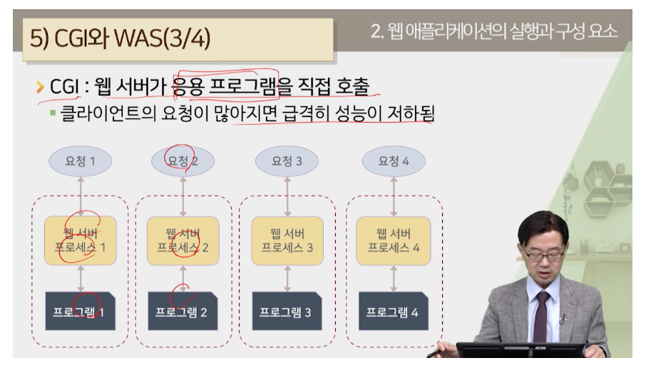
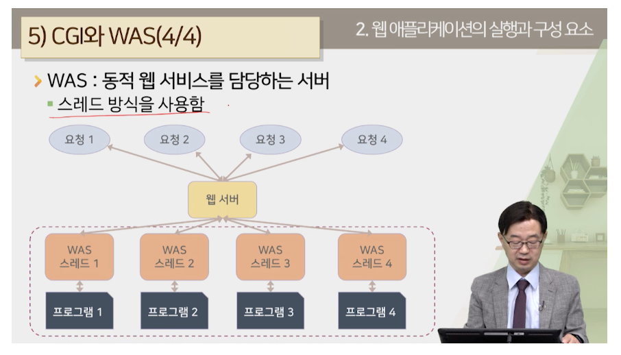
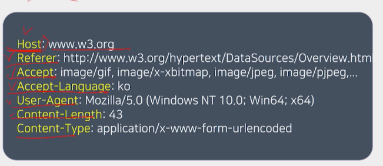

#웹과 자바
### 웹 문서
> 정적 웹 문서
> - 정적인 텍스트로 문서 내용 안 바뀜
> - 클라이어늩가 서버에 정적 웹 문서 요청하면 전달
> - 정적 웹 문서 요청하면 항상 결과가 동일!

> 동적 웹 문서
> - 최종 결과가 동적으로 맏ㄴ르어짐
> - JSP는 동적 웹 문서를 작성하는 기술

### 웹 애플리케이션

> 웹 애플리케이션
> - 웹에서 실행되는 응용 프로그램
> - 구분 : 클라이언트 실행/ 서버 실행, 컴파일/비컴파일 방식

> - 웹 클라이언트 : 웹 브라우저는 웹 서버에 요청을 보내고 응답 결과를 출력
> - 웹 서버 : 클라이언트 요청 처리, 결과 클라이언트에게
> - 웹 애플리케이션 서버( 웹 컨테이너 ) : 실행 환경, JSP 프로그램 실행시키고 결과 웹 서버에 전달 ex) WAS
> - 데이터베이스 : 웹 서비스 수행에 필요한 데이터 저장하고 제공

### CGI
> - (Common Gateway Interface)
> - 동적으로 웹 페이지를 생성하기 위한 방식 중 하나
> - 클라이언트 요청 있으면 개별 프로세서 생성해서 프로그램 실행
> - 동일한 CGI 요청해도 요청 개수만큼 프로세스 생성
> - printf("<html>\n\n<head><title>CGI 문서</title></head></html>)
> 

vs

### WAS
> - (Web Application Server)
> - 웹 애플리케이션을 실행하고 관리하는 별도의 전담 프로그램
> - 요청 마다 새로운 프로세스 만들지 않고, 하나의 가상 기계내에서 수행
> - 요청을 처리하기 위해 스레드 생성
> - API 제공, 부하 균형, 고장 조치 등 기능 수행
> 

### 웹 서버
> - 클라이언트 요청 바독 결과를 전달하는 기능 ex) Apache HHTP Server, Nginx
> - HTTP 프로토콜을 사용하여 클라이언트와 통신
>> 웹 서버를 HTTP 서버라고 함.

### 서블릿
> - Server + Applet의 합성어
> - 애플릿? 클라이언트 쪽에서 동작하는 java였음
>> - 결국 서버쪽에서 java사용해 웹 서비스 개발
>> - java 언어로 서블릿 클래스 -> 컴파일 -> 바이트 코드 -> 서버 탑재 -> 제공
>> - 소스 수정하면 다시 컴파일 필요

### JSP(JavaServer Pages)
> - 서블릿 대신에 사용할 수 있는 스크립트 형식의 언어
> - HTML 페이지 내에 삽입
> - JSP -> 서블릿으로 변환 후 제공 되는 것임
> - Java EE를 구성하는 기술 중 하나
>> - 스크립트 언어로 HTML페이지 삽입
>> - JAVA
>> - 표현 언어, 표현식, 액션 태그 등의 스크립트적 요소 제공
>> - 제공 많이함.
>> - 플랫폼 개방적

### 웹 컨테이너
> - 서블릿 컨테이너라고도 함
> - 웹 컴포넌트를 저장하고, 서블릿의 생명주기 관리
> - JSP -> 서블릿으로 변환하는 기능
> - 웹 서버에서 서블릿 실행되기 위한 환경 : 웹 서버, JDK, Tomcat(서블릿 컨테이너)

### HTTP 프로토콜
> - 웹 서버와 클라이언트 통신 규약
> - TCP 프로토콜에 기초한 애플리케이션 계층 프로토콜
>> - Connection oriented / stateless 특성
>> - 요청 위해선 접속 해야함, 상태 유지 x - 쿠키나 세션 활용
> - 연결 설정 -> 요청 메시지 전송 -> 응답 메시지 전송 -> 연결 끊기

### HTTP 요청 메시지
> - 시작라인 / 요청 헤더 / 요청몸체
> - 시작 라인
>> - 요청 방식, URL, 버전 번호
>> - GET일 땐 요청 몸체 쓰지 않음
> - 요청 헤더
>> - 헤더필드이름 : 값 형식으로 구성
>> - 요청 헤더 끝에 공백 라인 둠
> 
> - 요청 몸체
>> - POST 방식에 데이터 담아서 넘김

### HTTP 응답 메시지
> - 마찬가지로 시작라인, 헤더, 몸체
> - 시작 라인에 응답 코드 들어가있음.
>> 200 성공, 400 잘못된 요청, 404 요청 문서 없음
>> 405 요청 방식 지원안함 등등

